# Barking and Dagenham Yoga Club
***
 

### B&D yoga club is a yoga club site that wants to get people to practice yoga for a healthier life. B&D yoga club intends to attract people from the Barking and Dagenham area to join the club.
 
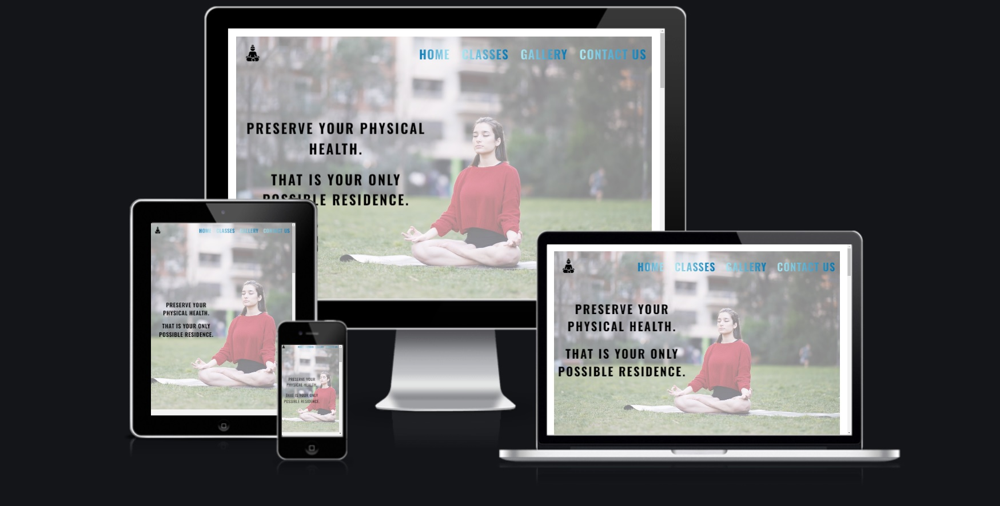

<a href="https://daooobg.github.io/yogaClubProject/index.html">Enter the site</a>

 

# Features
***
 

## Home Page
 

 * ### Navigation bar  - Includes links to all pages (Home, Classes, Gallery, and Contact us).
  
 
 
   
 
 * ### Landing page - Includes video and animated text to attract visitors' attention.
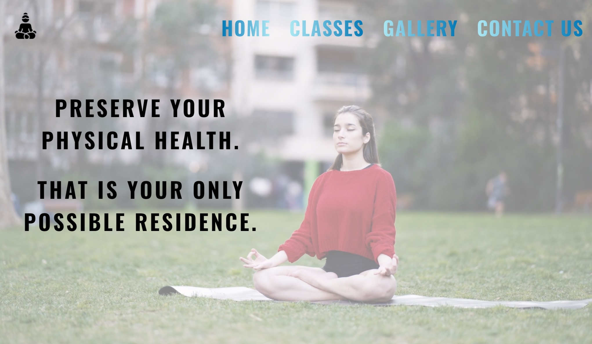
 

* ### About yoga section - Includes a brief explanation of why yoga is helpful, and on the right side, there are four photos with a hover effect.
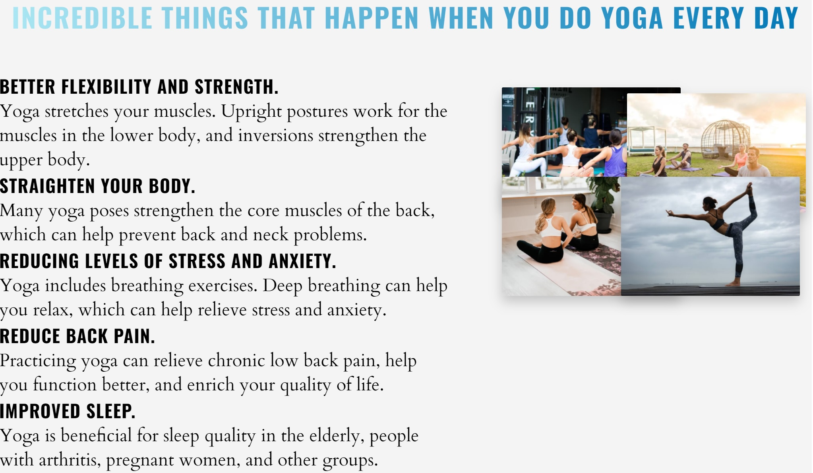
 

* ### Event section - Include upcoming events, and in the future, this section may grow into a larger one and include more events
 

* ### Team Section - Includes photos and names of all yoga club workers.
 

* ### Footer - Includes logo and links to Facebook, Twitter, Youtube, Instagram, and TikTok.

## Classes page

* ### The classes page consists of photos, and in the case of a mouse hover, the client can see a brief explanation of the type of yoga of the particular yoga picture.
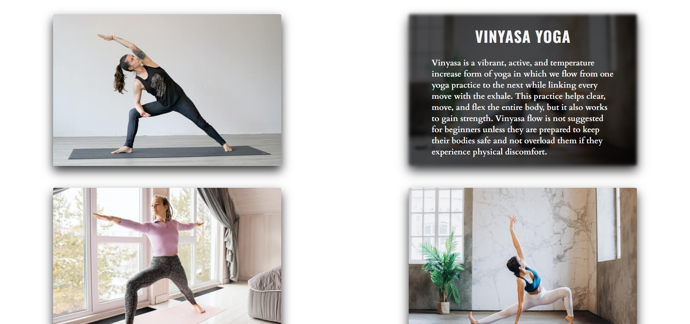
 

## Gallery Page
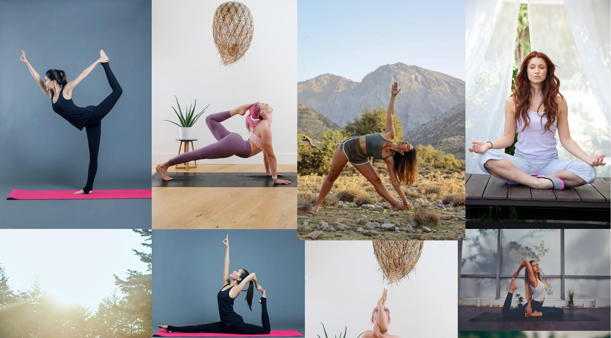
 

## Contact us  - Includes contact form
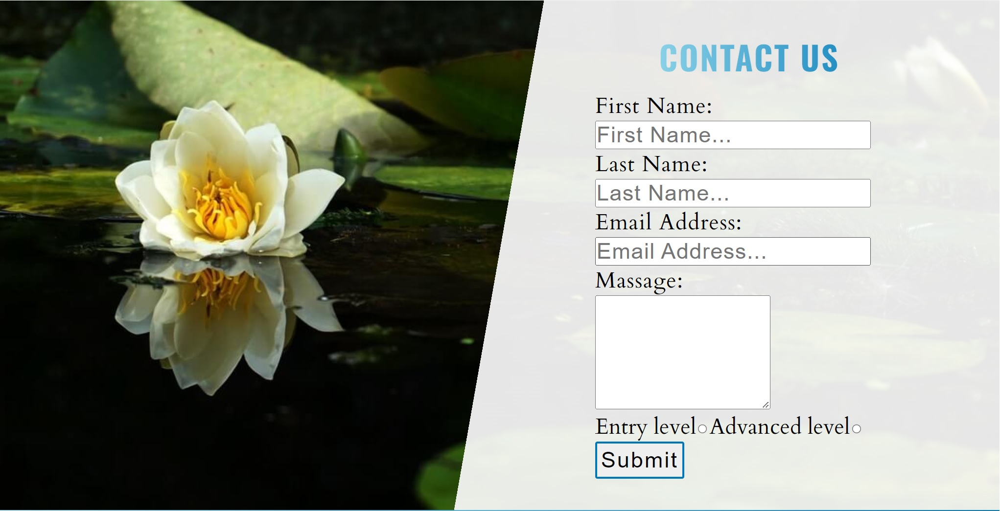
   

# Testing 
*** 
## Manual testing

|Buttons|Test|Action|
|------|----|------|
|Home|Working|Open home page|
|Classes|Working|Open Classes page|
|Gallery|Working|Open Galery page|
|Contact Us|Working|Open contact page|
|Facebook|Working|Open Facebook in new tab page|
|Twitter|Working|Open Twitter in new tab page|
|YouTube|Working|Open YouTube in new tab page|
|Instagram|Working|Open Instagram in new tab page|
|Tiktok|Working|Open Tiktok in new tab page|

## Automatic testing
 

* ### Lighthouse - The side was been testet with Lighthouse and this is the results:
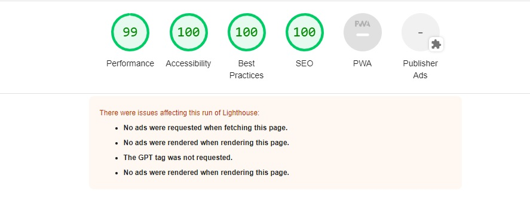
 

* ### W3C CSS Validation - The side was been testet with W3C CSS Validation and this is the results:
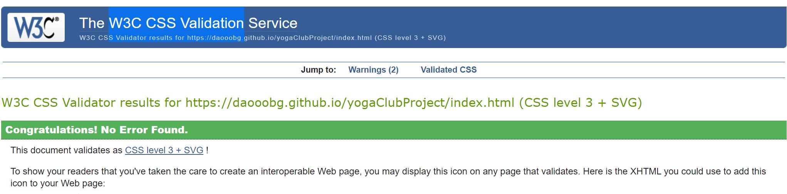
  

* ### W3C HTML Validation - The side was been testet with W3C HTML Validation and this is the results:
 

1.  Home Page
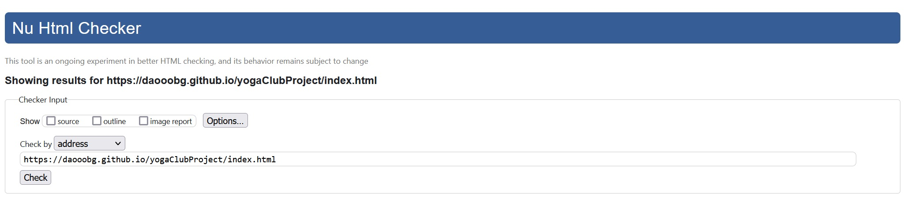
 

2.  Classes Page
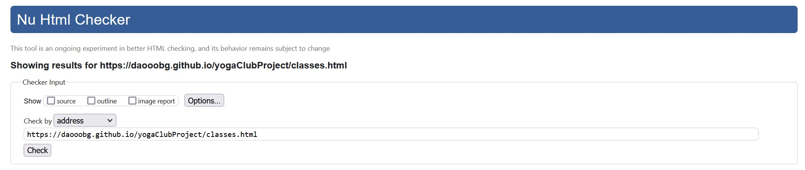
 

3.  Classes Page
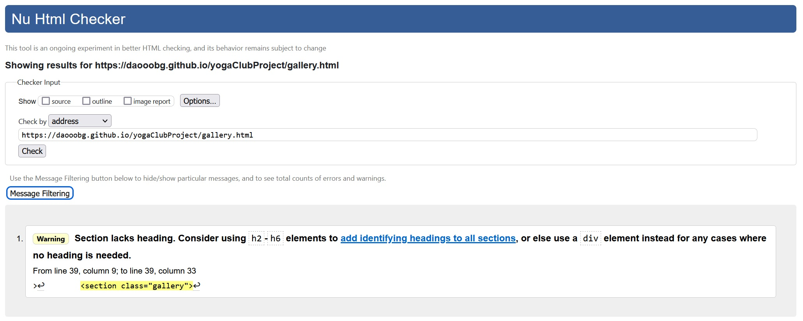
 

3.  Contact Us Page
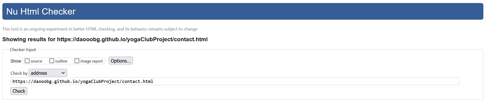
 

# Deployment
***

## I deployed my B&D Yoga club project using GitHub pages by the following steps:
1. Loging in to my GitHub account
2. Clicking on the 'settings'
3. Clicking on the 'GitHub Pages'
4. I selected 'Master branch'
5. That is the URL to my project: https://daooobg.github.io/yogaClubProject/index.html

# Credits
***
## I've got all the text written by me. I took the photos from <a href="https://unsplash.com/">Unsplash</a> and <a href="https://www.pexels.com/">Pexels</a>. Fonts are taken from <a href="https://fonts.google.com/">Google fonts</a>.  Thank you very much to the code institute and my mentor for the help.